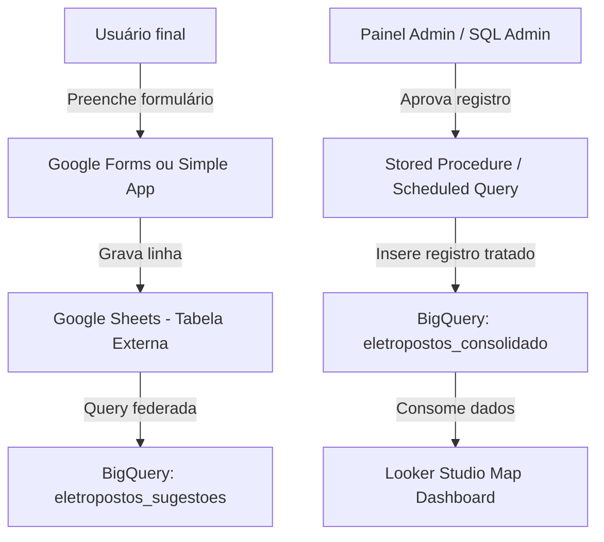

# Eletropostos Brasil: Plataforma Brasileira de Recarga Elétrica (PlugShare Lookalike)

Este documento descreve a arquitetura de dados, a metodologia de captura inicial, o fluxo de colaboração e o roadmap de implementação para a plataforma **Eletropostos Brasil** (Fase 1 e Fase 2).

---

## 🎯 Visão Geral do Projeto
Criar a base de dados mais abrangente, confiável e atualizada de postos de carregamento públicos e semipúblicos para veículos elétricos (VE) no Brasil, disponibilizando um mapa interativo para usuários e um repositório estruturado acessível via BigQuery/API para aplicações de terceiros.

---

## 🧱 Fase 1: Repositório de Dados & Infraestrutura (Modelo BD Híbrido)
A Fase 1 foca no baixo custo operacional, segurança de dados e prontidão de infraestrutura, replicando o modelo de ambiente de nuvem da Base dos Dados utilizado para o BNDES e Sou da Paz.

### 1. Dicionário de Dados Sugerido (`eletropostos_consolidado`)
A tabela de produção deve seguir o padrão de nomenclatura e tipos da Base dos Dados para facilitar consultas espaciais e integrações:

| Nome da Coluna | Tipo BigQuery | Descrição | Exemplo |
| :--- | :--- | :--- | :--- |
| `id_posto` | `STRING` | Hash único gerado a partir da lat/long e rede | `sha256(lat+long+rede)` |
| `nome` | `STRING` | Nome amigável do ponto de recarga | `Posto Petrobras - Recarga Rápida` |
| `latitude` | `FLOAT` | Latitude geográfica (WGS84) | `-23.5615` |
| `longitude` | `FLOAT` | Longitude geográfica (WGS84) | `-46.6560` |
| `endereco` | `STRING` | Endereço completo | `Av. Paulista, 1000 - Bela Vista, São Paulo - SP` |
| `cidade` | `STRING` | Nome do município | `São Paulo` |
| `estado` | `STRING` | Sigla da unidade federativa | `SP` |
| `tipo_conector` | `ARRAY<STRING>` | Conectores disponíveis (Tipo 2, CCS2, CHAdeMO, GBT) | `["CCS2", "Type 2"]` |
| `potencia_kw` | `FLOAT` | Potência máxima de carregamento em kW | `150.0` |
| `rede` | `STRING` | Nome da rede operadora (ou "Independente") | `Tupinambá`, `Raízen Power`, `Shell Recharge` |
| `preco_recarga` | `STRING` | Informação sobre taxa de uso / custo por kWh | `R$ 2,10/kWh` ou `Gratuito` |
| `status_operacional` | `STRING` | Estado atual (Ativo, Em Manutenção, Planejado) | `Ativo` |
| `is_publico` | `BOOLEAN` | True se for público (rua) ou semipúblico (shopping/mercado) | `True` |
| `fonte_dados` | `STRING` | Origem da primeira inserção do dado | `Google Places`, `Colaborativo` |
| `data_atualizacao` | `DATETIME` | Data e hora da última alteração no registro | `2026-06-29 19:30:00` |

---

### 2. Captura e Ingestão Inicial (Load de Partida)
Como os dados brutos ainda não existem na organização, criaremos um **Scraper de Partida (Data Crawler)** rodando em Python:
* **Fonte A: Google Places API**: Varredura sistemática do território brasileiro buscando as palavras-chave `posto de recarga veiculo eletrico`, `eletroposto`, `electric vehicle charging station`.
* **Fonte B: OpenStreetMap (OSM) / Overpass API**: Extração de nós geográficos marcados com a tag `amenity=charging_station` no Brasil.
* **Processamento**: Script unifica as bases, limpa duplicatas por proximidade geográfica (&le; 10 metros de raio) e preenche os metadados antes de injetar no BigQuery.

---

### 3. Arquitetura Colaborativa (Input de Usuários)
Para habilitar o caráter colaborativo sem a complexidade de criar uma aplicação web completa de início:

1. **Google Sheets como Staging**: Os dados informados pelo formulário caem diretamente em uma planilha do Google.
2. **Conexão Externa no BigQuery**: Criamos uma tabela externa no BigQuery (`eletropostos_sugestoes`) apontando para essa planilha.
3. **Mesa de Aprovação (Simples)**: O administrador altera a coluna de status na planilha para `APROVADO`. 
4. **Trigger SQL**: Uma consulta agendada diária consolida os registros marcados como `APROVADO` para a tabela definitiva (`eletropostos_consolidado`), gerando automaticamente o ID único e aplicando tratamento de dados básico.

---

### 4. Analytics & Visualização (Looker Studio)
* Conexão direta com a tabela definitiva do BigQuery.
* Renderização de mapa térmico e mapa de pontos nativo do Google Maps dentro do Looker Studio.
* Filtros rápidos por Estado, Município, Rede, Tipo de Conector e Potência (AC vs. DC).

---

## 📱 Fase 2: Nível de Aplicação e Escalabilidade

Na Fase 2, a arquitetura evolui de um modelo de banco de dados administrativo para uma aplicação de nível de produto:

1. **Camada de Aplicação Web (Frontend/Backend)**:
   * Interface estilo PlugShare construída em Next.js ou React Mapbox GL para maior interatividade geográfica e performance mobile.
   * Backend em Node.js/Python com API Rest para servir os postos diretamente de um banco transacional rápido e espacial (PostgreSQL com PostGIS ou MongoDB).
2. **Processo Automatizado de Aprovação (Crowdsourcing)**:
   * Painel administrativo web para validação ágil de fotos, avaliações, status em tempo real (ocupado/livre) e novos pontos reportados pelos usuários.
   * Sistema de reputação de usuários para aprovação automática de edições feitas por perfis confiáveis.
3. **Novas Fontes & Dados em Tempo Real (Integrações OCPP)**:
   * Integração de APIs proprietárias de redes de eletropostos (Tupinambá, EzVolt, Volvo) para exibir status dos carregadores em tempo real (Conectado, Livre, Ocupado, Inativo) via protocolo OCPP.
